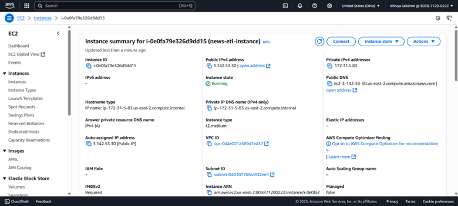
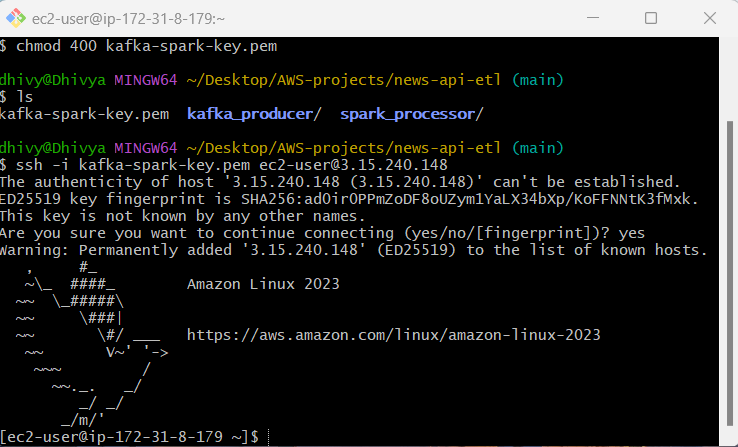
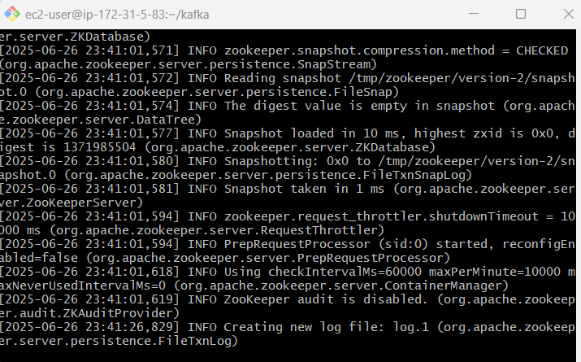
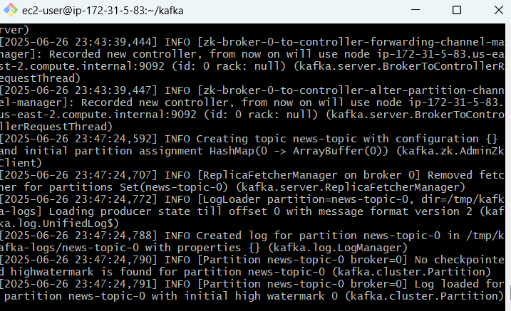
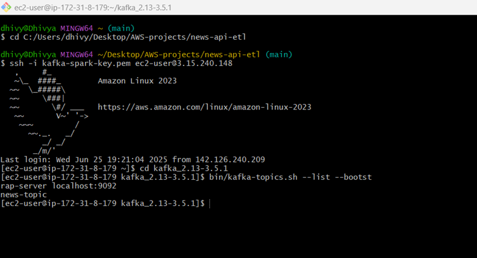
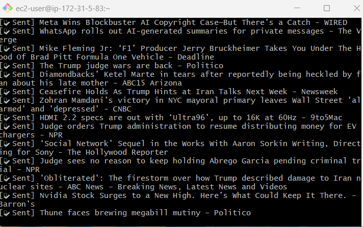
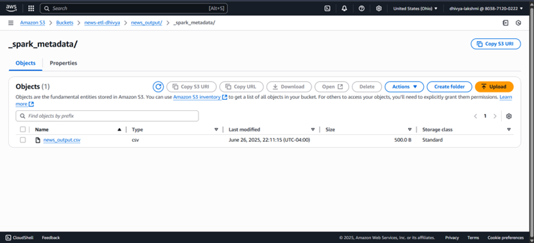

# Real-Time News ETL Pipeline

This project implements a real-time ETL pipeline using Apache Kafka and Apache Spark Streaming on AWS.

## 📸 Project Output Screenshots

#### 🟢 EC2 Instance Creation
> Provisioning an EC2 instance to run Kafka and Spark.

#### 🟢 SSH into EC2
> Connecting securely to your instance.

#### 🟢 Zookeeper Running
> Zookeeper service started successfully.

#### 🟢 Kafka Broker Running
> Kafka broker active and listening.

#### 🟢 Kafka Topic Creation
> Creating the `news-topic` for incoming data.

#### 🟢 Kafka Producer Output
> Producer sending live news articles to Kafka.

#### 🟢 S3 Output
> Processed CSV files saved in S3 bucket.

